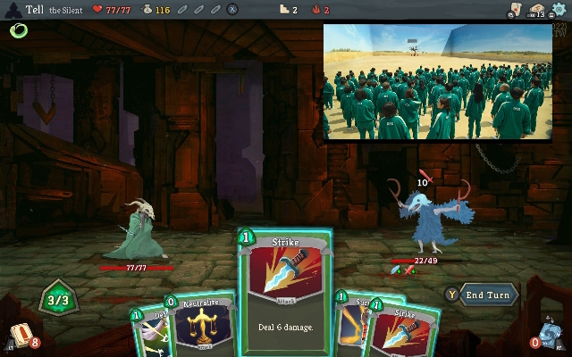
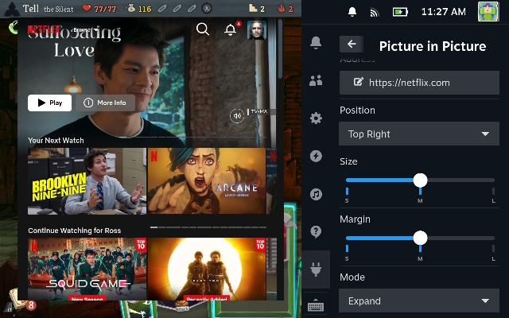

# Picture in Picture  
[](https://deckbrew.xyz/discord)

Steam Deck でゲームをしながらお気に入りの動画 / 配信を重ね表示 (PiP) する Decky プラグイン。





## ✅ 主な機能
* Picture in Picture 表示 / フル展開 (Expand)
* 8 方向（時計回り）位置スライダー: TL → T → TR → R → BR → B → BL → L
* サイズ / マージン調整スライダー
* URL 変更ダイアログ

## 🚀 クイックスタート (Release ZIP を URL でインストール)
Decky Loader の "Install from URL" (設定/Advanced などに配置) に GitHub Release の ZIP アセット URL を貼り付けて導入します。

### 0. Release ZIP を作る
PowerShell:
```powershell
pwsh -File .\scripts\package-release.ps1
```
生成された `decky-pip-<version>.zip` を GitHub Releases にアップロード。

### 1. Release を作成
1. `package.json` の version を更新
2. タグ付け: `git tag v1.0.1 && git push origin v1.0.1`
3. GitHub → Releases → Draft new release → アセットに ZIP を添付 → Publish

### 2. ZIP 直リンク取得
公開後のアセット URL 例:
```
https://github.com/<your-user>/decky-pip/releases/download/v1.0.1/decky-pip-v1.0.1.zip
```

### 3. Decky Loader 側
Settings (または Advanced) → Install from URL → 上記 URL を入力 → Install。
インストール後 Plugins リストに表示される。更新時は新しいタグ + 新 ZIP を再アップロードし、新 URL を使う。

---
従来の Raw `deck.json` を使うカスタムリポ方式とは異なります。`deck.json` (現状リポ内のデバイス設定用) は URL インストールには不要です。

## 🔁 代替: 自分の Fork をそのまま利用 (参考)
フォーク + dist コミットを Decky の別手段で参照する場合の手順を残します。

### 1. 依存 (Windows)
1. Node.js (18+ 推奨)
2. Git
3. GitHub CLI: `winget install --id GitHub.cli`
4. PowerShell 7 推奨 (任意)

### 2. フォークと push を自動化 (任意)
リポジトリ直下 (または clone 済みフォルダ) で:
```powershell
pwsh -File .\scripts\auto-fork-and-push.ps1 -Upstream rossimo/decky-pip -BuildDist -IgnorePackageLock
```
完了後、表示される `Raw deck.json URL` をコピーします。

### 3. (任意) Custom Repo を使う場合
あなたの Decky Loader ビルドに Custom Repos UI が有効なときのみ。インデックス用の別形式 deck.json が必要 (本リポの deck.json とは異なるため未対応)。

### 4. 更新
コード変更 → `npm run build` → `git add dist && git commit -m "feat: ..." && git push` → Decky Loader でアップデート反映。

## 🔧 手動インストール (テスト用)
```powershell
npm install
npm run build
scp -r dist deck@<deck-ip>:~/homebrew/plugins/decky-pip/dist
scp plugin.json deck@<deck-ip>:~/homebrew/plugins/decky-pip/plugin.json
```
Deck 側で Decky を Reload。

## 📦 Release / 配布ベストプラクティス
| 項目 | 推奨 |
|------|------|
| dist コミット | Yes (Decky Store でビルド不要に) |
| バージョン管理 | `package.json` version 更新 + タグ `vX.Y.Z` |
| Release | GitHub Release で CHANGELOG を添付 |
| 画像 | `plugin.json.publish.image` Raw URL を更新 |
| ライセンス | BSD-3-Clause 維持 |

## 🧪 開発メモ
* `npm run build` で `dist/` を更新
* 位置スライダーは内部 enum を時計回り順の配列でマッピング
* Decky の UI 再読み込み: Quick Access → 歯車 → Reload Plugins

## ❓ トラブルシュート
| 症状 | 対処 |
|------|------|
| 表示されない | `dist` がない/Raw URL 間違い。Reload または再インストール |
| 403 push | 自分の Fork へ remote を変更 (`git remote set-url origin ...`) |
| 位置が変わらない | Reload Plugins / キャッシュ解消 |
| package-lock が混ざる | `-IgnorePackageLock` オプション使用 |

## 📝 ライセンス
BSD-3-Clause

---
Pull Request / Issue 歓迎。
